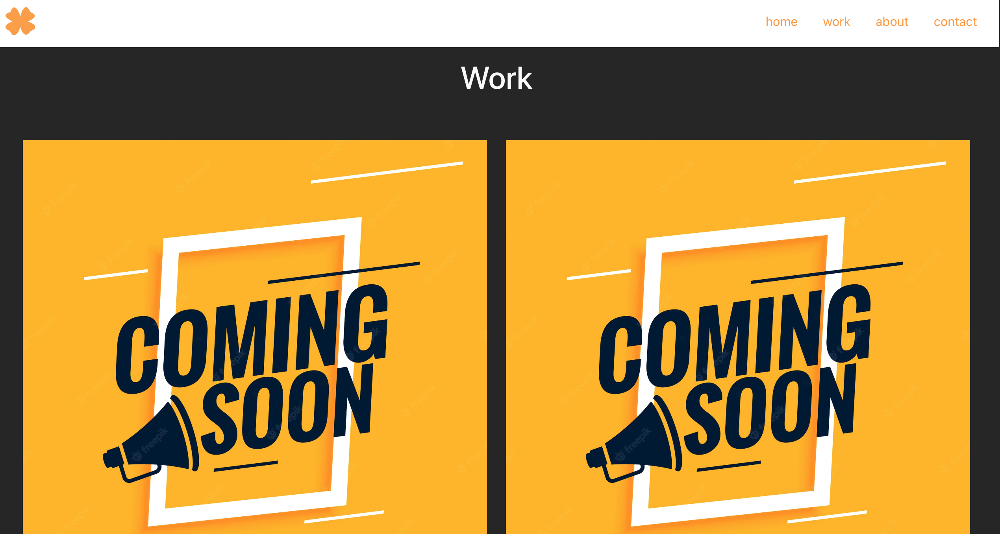

# My React app Portfolio

## Intro

This repo contains the code for my react app, this is the first time i have tried to produce a react app and at first i found it quite difficult; i believe that i need to continue my javascript practice and do more research on react to be more comfortable with creating a react portfolio, however in doing this project i gained alot more insite on how it works and how to use it and the terminal. There were quite a few learning experiences while doing this task and i am happy with the result.

To create this portfolio i have used bootstrap and i have took code from my previous bootstrap portfolio to create this react app. This allowed me to better understand how the react app works and allowed me to focus more on the functionality of react instead of spending the time trying to design and create a new portfolio which i think greatly helped me gain a better understanding of react

## Table of Contents

- [Installation](#installation)
- [Technologies](#technologie)
- [Screenshots](#screenshots)
- [License](#license)

## Installation

No need to install anything to view my deployed react portfolio you can follow this link [here](https://chriskeno95.github.io/my-portfolio/)

## Technologies

To create this project i have used React and bootstrap.

## Screenshots

